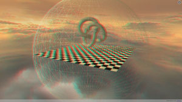
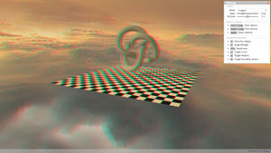
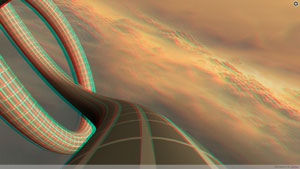
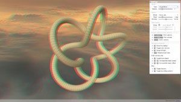

# threejs-stereoscopic
Playing with [three.js](https://github.com/mrdoob/three.js/) stereoscopic rendering.

- **[Boilerplate](boilerplate.html)**

 

- **[Ride](ride.html)**

 

If you want to run the HTML files locally without an HTTP server, please refer to this document:
https://github.com/mrdoob/three.js/wiki/How-to-run-things-locally.
 